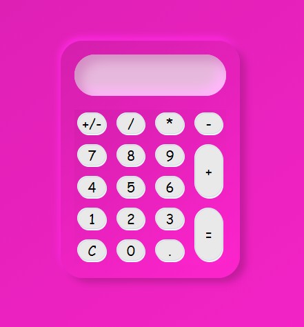

# Mini-Calculator
A basic calculator which can do any calculation that any other common calculator does. HTML5, CSS3, Javascript are used. It is also given neumorphic design.

## Links
**Live at :** https://rohit-gupta11.github.io/Mini-Calculator/
## Tech Stack
CSS, HTML, Vanilla Javascript
  
## Screenshots

## Key Points

- Responsive
- Neumorphic Design
  
